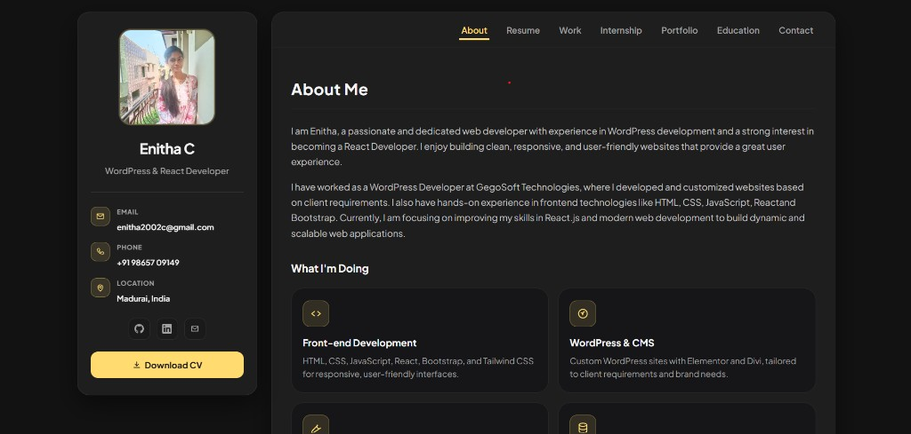
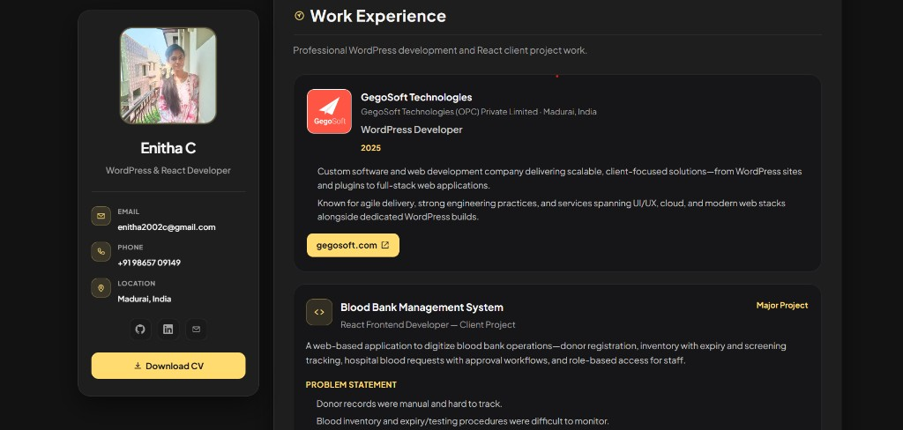
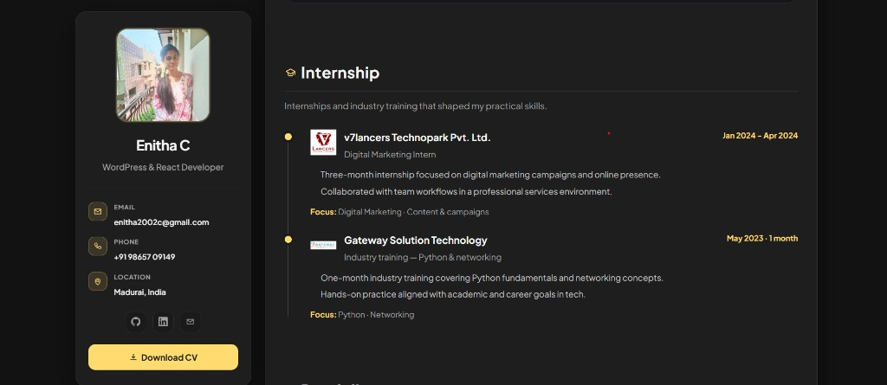
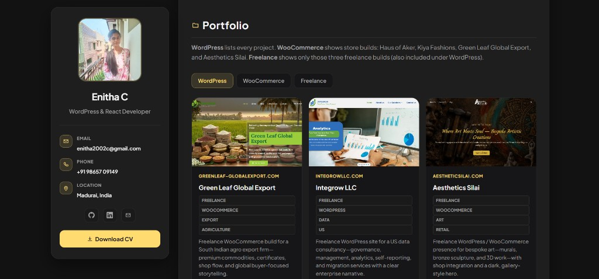

# Enitha C — Developer Portfolio

[](https://enithachandrasekaran.github.io/enitha-portfolio/)
[](https://react.dev/)
[](https://vitejs.dev/)

> Personal portfolio for **Enitha C** — WordPress & React developer from Madurai, India. Showcases live client work, professional experience, skills, education, and a working contact form.

**Live demo:** [enithachandrasekaran.github.io/enitha-portfolio](https://enithachandrasekaran.github.io/enitha-portfolio/)

---

## Project overview

A responsive, dark-themed portfolio built with **Vite + React**. It uses a vCard-style layout (sidebar profile + scrollable main panel) and is deployed on **GitHub Pages**.

Recruiters can quickly see:

- Who I am and what I do (About)
- Skills and certifications (Resume)
- **Work experience** — GegoSoft WordPress role + Blood Bank Management System (React client project)
- **Internships** — v7lancers, Gateway Solution Technology
- **13 live WordPress/WooCommerce projects** with filters
- Education (MCA, BCA) and contact form

---

## Features

| Area | Highlights |
|------|------------|
| **Layout** | Sticky sidebar, horizontal nav, smooth scroll anchors |
| **Animations** | Framer Motion scroll reveals, staggered cards |
| **Skills** | Skill group cards (Front-end, Tools, CMS, Certifications) |
| **Projects** | Filter by WordPress / WooCommerce / Freelance with project thumbnails |
| **Work** | GegoSoft WordPress developer role + full Blood Bank project breakdown |
| **Contact** | Web3Forms integration (name, email, phone, message) |
| **Responsive** | Mobile-friendly sidebar, nav toggle, adaptive grids |
| **Deploy** | GitHub Actions → `gh-pages` branch (auto on push to `main`) |
| **A11y** | `prefers-reduced-motion` support, semantic sections, ARIA labels |

---

## Technologies used

**Frontend**

- React 19, Vite 8
- Framer Motion — animations
- Tailwind CSS 4 — utility styling
- Custom CSS — vCard dark theme (`#121212`, gold accent `#ffdb70`)

**Tooling**

- ESLint, React Compiler (Babel)
- GitHub Actions — CI deploy to GitHub Pages

**Integrations**

- [Web3Forms](https://web3forms.com) — contact form (no backend required)

---

## Screenshots

### Home page



### Work experience



### Internship



### Portfolio



[View live demo](https://enithachandrasekaran.github.io/enitha-portfolio/)

---

## Installation

### Prerequisites

- [Node.js](https://nodejs.org/) 18+ (22 recommended)
- npm

### Steps

```bash
# Clone the repository
git clone https://github.com/Enithachandrasekaran/enitha-portfolio.git
cd enitha-portfolio

# Install dependencies
npm install

# Environment variables (contact form)
cp .env.example .env
```

Edit `.env`:

```env
VITE_CONTACT_RECEIVER_EMAIL=your-email@example.com
VITE_WEB3FORMS_ACCESS_KEY=your-web3forms-key
```

Get a free key at [web3forms.com](https://web3forms.com).

```bash
# Start development server
npm run dev
```

Open [http://localhost:5173](http://localhost:5173).

---

## Scripts

| Command | Description |
|---------|-------------|
| `npm run dev` | Local dev server with hot reload |
| `npm run build` | Production build → `dist/` |
| `npm run preview` | Preview production build locally |
| `npm run lint` | Run ESLint |

---

## Project structure

```
enitha-portfolio/
│
├── src/
│   ├── components/
│   │   ├── About/
│   │   ├── Skills/
│   │   ├── WorkExperience/
│   │   ├── Experience/
│   │   ├── Projects/
│   │   ├── Education/
│   │   ├── Contact/
│   │   ├── Sidebar/
│   │   └── Motion/
│   ├── data/
│   └── utils/
│
├── public/             # Profile photo, logos, project images
│
├── screenshots/
│   ├── home-page.png
│   ├── work-experience.png
│   ├── internship.png
│   └── portfolio.png
│
├── scripts/
│   └── capture-screenshots.mjs
│
├── .github/workflows/  # Auto-deploy to gh-pages
├── README.md
├── package.json
└── vite.config.js
```

---

## Deployment

Push to `main` → GitHub Actions builds and publishes to **`gh-pages`**.

**Pages settings:** Deploy from branch → **`gh-pages`** / `(root)`

Full guide: **[DEPLOY.md](./DEPLOY.md)**

---

## Author

**Enitha C**

- Portfolio: [enithachandrasekaran.github.io/enitha-portfolio](https://enithachandrasekaran.github.io/enitha-portfolio/)
- GitHub: [@Enithachandrasekaran](https://github.com/Enithachandrasekaran)
- LinkedIn: [enitha-c-2174a6230](https://www.linkedin.com/in/enitha-c-2174a6230/)
- Email: enitha2002c@gmail.com

---

## License

This project is for personal portfolio use. Project screenshots and client site references belong to their respective owners.
